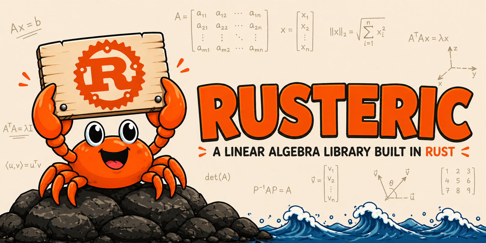

<div align="center">
  
  <p><em>shoutout to "image generator" by naif alotaibi on DALL·E for generating this image 🙏</em></p>
</div>

# Rusteric

**Rusteric** is a linear algebra library written in Rust, implementing the core operations taught in a standard linear algebra course. It operates on a flat `Vec<f64>` matrix representation and provides a clean set of functions for matrix arithmetic, decomposition, and transformation.

## Operations

- [Arithmetic](src/operations/arithmetic.rs) — addition, subtraction, and multiplication
- [Row Operations](src/operations/row_ops.rs) — row swap, row scaling, and row replacement
- [Echelon Forms](src/operations/echelon.rs) — row echelon form and reduced row echelon form
- [Determinant](src/operations/determinant.rs) — determinant of a square matrix via Gaussian elimination
- [Inverse](src/operations/inverse.rs) — matrix inverse via augmented RREF
- [Transpose](src/operations/transpose.rs) — matrix transpose

## Getting Started

### Clone the repository

```bash
git clone https://github.com/juliansanchez/rusteric.git
cd linear-rustgebra
```

### Build

```bash
cargo build
```

### Run

```bash
cargo run
```

### Run tests

Run all tests:

```bash
cargo test
```

Run tests for a specific module:

```bash
cargo test --test row_ops_tests
cargo test --test echelon_tests
cargo test --test arithmetic_tests
cargo test --test determinant_tests
cargo test --test inverse_tests
cargo test --test transpose_tests
```
